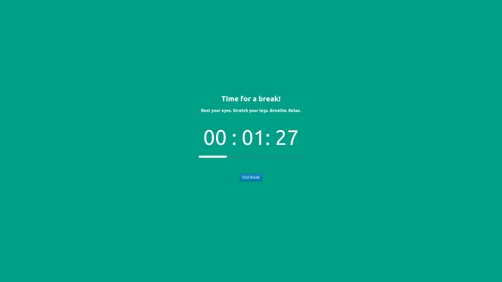
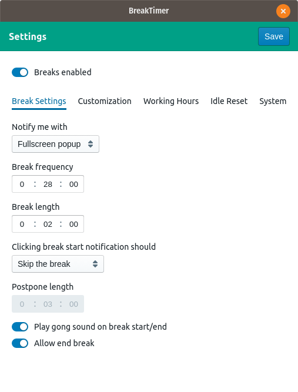
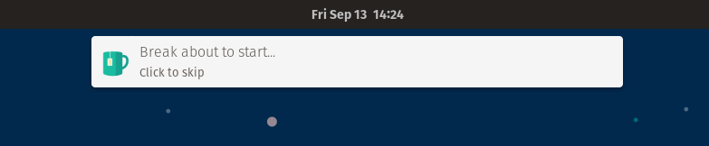

# BreakTimer App - https://breaktimer.app


🔨 **Looking for contributors** 🔨 If you feel like getting involved, please get in contact!

BreakTimer is a desktop application for managing and enforcing periodic breaks. BreakTimer is available for Windows, macOS, and Linux.

BreakTimer allows you to customize:

- How long your breaks are and how often do you wish to have them
- Whether to be reminded with a simple notification or a fullscreen break window
- Working hours so you are only reminded when you want to be
- The content of messages shown during breaks.
- Whether to intelligently restart your break countdown when it detects that you have not been using the computer

We do not offer support for enterprise environments or commercial deployment. This software is provided ‘as is’ without any warranties or guarantees of support.

## Installation

- **Windows** - [BreakTimer.exe](https://github.com/tom-james-watson/breaktimer-app/releases/latest/download/BreakTimer.exe) (Unsigned - you will receive a warning on install, press more info -> run anyway. Will not auto-update)
- **macOS** - [BreakTimer.dmg](https://github.com/tom-james-watson/breaktimer-app/releases/latest/download/BreakTimer.dmg)
- **Linux**:
  - Auto-updating **[preferred]**:
    - [BreakTimer Snap](https://snapcraft.io/breaktimer) - **also available in the Ubuntu App Store**.
    - [BreakTimer.AppImage](https://github.com/tom-james-watson/breaktimer-app/releases/latest/download/BreakTimer.AppImage)
  - Non auto-updating
    - [BreakTimer.deb](https://github.com/tom-james-watson/breaktimer-app/releases/latest/download/BreakTimer.deb)
    - [BreakTimer.rpm](https://github.com/tom-james-watson/breaktimer-app/releases/latest/download/BreakTimer.rpm) (untested)
    - [BreakTimer.tar.gz](https://github.com/tom-james-watson/breaktimer-app/releases/latest/download/BreakTimer.tar.gz)

## Screenshots

## 

## 



## FAQ

### Why can't I see the app in the tray?

Some operating systems, such as Linux distributions running plain Gnome (e.g. Fedora) or Pantheon (e.g. Elementary OS), don't support system tray icons. In this case, simply re-run the app to open the settings window. You will lose access to certain functionality only available in the tray menu, but at least this workaround lets you use the app.

### Is there a way to control the app via the command line?

On Linux, if you run the app via the command line there is some basic support for command line arguments:

Disable breaks:

```bash
breaktimer disable
```

Enable breaks:

```bash
breaktimer enable
```

### How can I pass you my log files to help you debug an issue?

You can find the log file for BreakTimer here:

Linux: `/home/<USERNAME>/.config/BreakTimer/logs/main.log`

macOS: `/Users/<USERNAME>/Library/Logs/BreakTimer/logs/main.log`

Windows: `C:\Users\<USERNAME>\AppData\Roaming\BreakTimer\logs/main.log`

You can either upload this to a cloud service such as Dropbox or Google Drive and enable public sharing, or you can email the file as an attachment to contact@breaktimer.app. The log files do not contain any personally identifying information.

Please try and include a timestamp for roughly when you have seen the issue so that I can find the relevant place in the log file.

### How can I hard reset the app's data

In case a bug has left the UI in an unrecoverable state, you can reset the app data by exiting the app, deleting the below folder, and starting the app again.

Linux: `/home/<USERNAME>/.config/BreakTimer`

macOS: `/Users/<USERNAME>/Library/Logs/BreakTimer`

Windows: `C:\Users\<USERNAME>\AppData\Roaming\BreakTimer`

## Development

See [./DEVELOPMENT.md](DEVELOPMENT.md).
